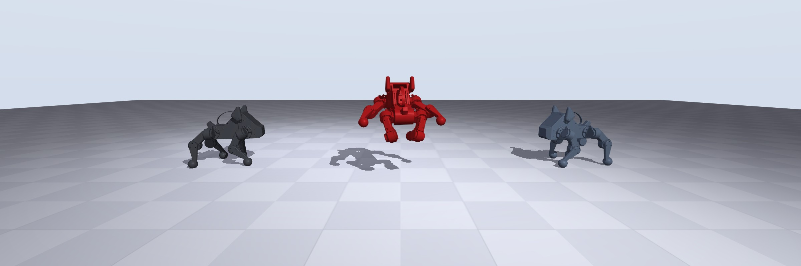

# mjlab — Pupper v3 fork

This is a fork of [mjlab](https://github.com/mujocolab/mjlab) that adds the
**Pupper v3** quadruped (Stanford CS 123): the robot model, locomotion and gait
tasks, sim2real latency modeling, and an exporter that produces the
`policy.json` the robot's `neural_controller` loads. Everything else — the
manager-based environment API on top of GPU-accelerated
[MuJoCo Warp](https://github.com/google-deepmind/mujoco_warp) — is upstream
mjlab; see its [documentation](https://mujocolab.github.io/mjlab/) for the
framework itself.

## Quickstart

Training needs an NVIDIA GPU (macOS works for evaluation only). All commands go
through [uv](https://docs.astral.sh/uv/) — **always `uv run ...`, never bare
`python`**; the first `uv run` resolves and installs everything.

```bash
git clone https://github.com/cs123-stanford/pupper-mjlab.git && cd pupper-mjlab

# Train a basic Pupper walking policy. Every task ships with all reward
# weights at ZERO -- untouched, this learns to do nothing. The course notebook
# is where you set your weights; this is the raw entry point it drives.
uv run train Mjlab-VelocityFS-Flat-Pupper-v3 --env.scene.num-envs 4096

# Watch a policy while (or after) it trains -- fetches the latest checkpoint
# from Weights & Biases.
uv run play Mjlab-VelocityFS-Flat-Pupper-v3 --wandb-run-path <entity>/mjlab/<run-id>

# Sanity-check an MDP without a trained policy.
uv run play Mjlab-VelocityFS-Flat-Pupper-v3 --agent zero    # or --agent random
```

The course notebook is `notebooks/CS123_Pupper_mjlab.ipynb` — it walks the
whole loop (train, evaluate, export, deploy) and runs on Colab.
`notebooks/create_new_task.ipynb` is the upstream tutorial for building a new
task from scratch (using the cartpole task as the example).

## Pupper tasks

| Task id | What it trains |
| --- | --- |
| `Mjlab-VelocityFS-Flat-Pupper-v3` | Velocity tracking from scratch in the 48-dim gait frame (reference dims zero) — the main-lab baseline. |
| `Mjlab-StableGait-Flat-Pupper-v3` / `-Bumpy-` | Velocity tracking that shapes a triangular trot for fore/aft and a stepping-in-place cycle for turning and side-stepping; the Bumpy variant adds rough ground. |
| `Mjlab-MixedGaits-Flat-Pupper-v3` / `-Bumpy-` | Per-command reference switching with a separate fast branch above 0.5 m/s. What plays in the fast branch is up to you — see the optional reference lab. |
| `Mjlab-Mystery-Flat-Pupper-v3` / `-Bumpy-` | ??? |

**The lift gait is yours**: only the trot reference ships
(`src/mjlab/tasks/pupper_gait/mdp/gait_reference.py`). StableGait also needs a
lift gait — stepping in place, for turns and sidesteps — and refuses to build
until you design it: fill in the `TODO(student)` block in that file (it is
your lab 3 gait machinery with one new entry), then inspect it with
`uv run python -m mjlab.tasks.pupper_gait.visualize_reference --gait lift`.

**The optional reference lab**: every other reference slot plays the trot
until you provide something better — extend the generator tables, or capture a
rollout of your own trained policy, process it (mirror average, loop-close),
and drop it in as a `captured_*.npz`. Finding references that beat the trot is
the lab.

## Sim2real and deploy

```bash
uv run export-pupper-policy Mjlab-MixedGaits-Flat-Pupper-v3 \
    --wandb-run-path mjlab/<run-id> --upload-wandb
```

Training runs also upload `policy.json` to their W&B run automatically when
they end (normal finish or Ctrl+C), so usually there is no export step to run
by hand.

The exported JSON is self-describing (deploy contract v2): it declares its own
observation layout (`obs_spec`), teleop bounds (`command_clip`), the IMU-yaw
heading-hold parameters (`heading_hold`), and the reference tables the robot
replays. The robot side lives in the companion repo
**`pupper_gait_deploy`** — `download_policy.py` pulls and validates a run's
JSON, `install.py` installs it into `pupperv3-monorepo` and rebuilds.

Two things make these policies survive the real robot:

- The Pupper tasks model the deploy stack's sensor and actuation latency
  (observation and actuator `delay_min_lag`/`delay_max_lag`); policies trained
  without it walk in sim and shake on hardware.
- The exporter's reference-table math has a NumPy mirror that is parity-tested
  against both training-time torch and the robot's C++
  (`tests/test_pupper_gait_export.py`, and golden fixtures checked into
  `pupper_gait_deploy/test/`).

## Repo map

- `src/mjlab/` — the framework: `envs/` (manager-based RL env + MDP terms),
  `managers/`, `terrains/`, `viewer/`, `sim/`.
- `src/mjlab/asset_zoo/robots/pupper_v3/` — the Pupper model and constants
  (joint order, observation dims).
- `src/mjlab/tasks/pupper/` — velocity tasks, the base exporter
  (contract v2 JSON), and the RL runner (auto-upload on run end).
- `src/mjlab/tasks/pupper_gait/` — the gait tasks, reference-table generation,
  the gait exporter and its NumPy parity mirrors.
- `src/mjlab/scripts/export_pupper_policy.py` — the `export-pupper-policy`
  entry point.
- `src/mjlab/tasks/{velocity,tracking,manipulation,cartpole}/` — upstream
  example tasks (G1/Go1/YAM); the cartpole is the create-a-task tutorial.
- `tests/` — `test_pupper*.py` cover export parity and latency modeling.
- `notebooks/` — the CS 123 lab, the upstream demo, and the new-task tutorial.
- `docs/` — upstream Sphinx documentation.

## Development workflow

```sh
# 1. Make changes.

# 2. Type check.
uv run ty check   # Fast
uv run pyright    # More thorough, but slower

# 3. Run tests.
uv run pytest tests/<test_file>.py   # Prefer single files for iteration speed

# 4. Format and lint before committing.
uv run ruff format
uv run ruff check --fix
```

Bundled Makefile targets: `make format`, `make type`, `make check`
(format + type), `make test-fast` (skips slow tests), `make test`, `make docs`.
Always run `make check` before committing; do not commit code that fails type
checking. Style: 88-column lines (code, comments, docstrings); tests are plain
functions with fixtures, not classes; avoid local imports unless needed to
break an import cycle.

## License and citation

mjlab is licensed under the [Apache License, Version 2.0](LICENSE). Portions
under `src/mjlab/utils/lab_api/` are forked from
[NVIDIA Isaac Lab](https://github.com/isaac-sim/IsaacLab) (BSD-3-Clause; see
file headers).

If you use mjlab in your research, please cite the upstream project:

```bibtex
@misc{zakka2026mjlablightweightframeworkgpuaccelerated,
  title={mjlab: A Lightweight Framework for GPU-Accelerated Robot Learning},
  author={Kevin Zakka and Qiayuan Liao and Brent Yi and Louis Le Lay and Koushil Sreenath and Pieter Abbeel},
  year={2026},
  eprint={2601.22074},
  archivePrefix={arXiv},
  primaryClass={cs.RO},
  url={https://arxiv.org/abs/2601.22074},
}
```
